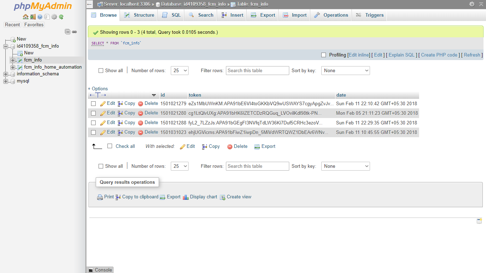
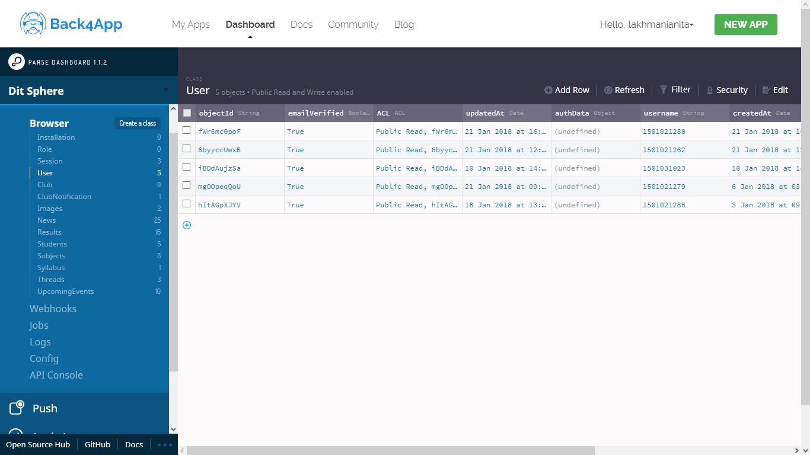

# DIT Sphere Files

<h1>Web Scrapping</h1>
<h3>Idea</h3>
Earlier I was using a simple model where I was relying manually on an Admin to update the News Section from DIT University's Webpage and Upload to Cloud's DB.
 
But then I thought after all Admin is also a Human Being. So why not do something which will <b>Ping the Users Automatically</b> whenever there is any new NEWS or UPCOMING EVENTS content on the website.
 
So I decided to use the idea of Web Scrapping from there.

<h3>Execution</h3>
<ul>
  <li>I made few PHP scripts which fetches the NEWS' and UPCOMING EVENTS' content from the DIT University's Webpage</li>
  <li>Once it fetches all the Content of that page : 
    <ul>
      <li>First I updated new details on my server.
      <li>Then I Sent Notification to all the active users i.e. See MYSQL section.
    </ul>
  </li>
  <li>Run these Scripts on your live server <b>(Cron Job)</b> repeatedly and frequency depends on you i.e. every 10 mins or 1 hr etc...</li>
</ul>

<h1>MYSQL Database</h1>
Using MYSQL to to keep the Device Tokens so that it is fetched locally on the server so that notifications and messages are sent with minimun possible delay.

<h1>MYSQL Database Structure</h1>

<h1>Cloud's Mongo Database</h1>
Using Cloud's Mongo DB to keep the all the other necessary details for the app like : 
<ul>
  <li>User Info</li>
  <li>Results</li>
  <li>News</li>
  <li>Conversation Threads' Details</li>
  <li>Upcoming Events etc....</li>
</ul>

<h1>Cloud's MONGO DB Structure</h1>

